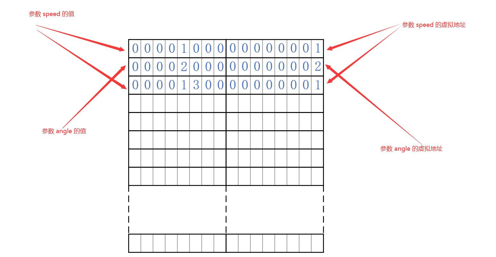

# EEPROM_Emulation
Synwit MCU on-chip Flash Emulate EEPROM

请将 EEPROM_Emulation 文件夹置于如下目录结构下，然后才能打开 EEPROM_Emulation 下的 Keil 工程并编译：
```
<root_dir>/
	EEPROM_Emulation
	SWM181_Lib
	SWM190_Lib
	SWM2X1_Lib
	SWM241_Lib
	SWM260_Lib
	SWM320_Lib
	SWM341_Lib
```


# 工作原理

Flash 和 EEPROM 的主要区别在于可擦单元大小，EEPROM 可以字节擦写，而 Flash 只能块（扇区）擦除。这意味着如果在一个 Flash 扇区上存储多个参数时，扇区的擦除次数是该扇区上所有存储参数修改次数的总和，因此用作参数存储器时，Flash 相比 EEPROM 更容易写坏。

解决这个问题的方法是，不再将参数存储在 Flash 的固定地址，而是给每个参数分配一个唯一的数字用作虚拟地址，将参数写入 Flash 时同时将虚拟地址写入 Flash。

举例说明，执行如下的伪代码，将产生下图所示的存储效果：

``` c
#define EE_ADDR_Speed	0x0001
#define EE_ADDR_Angle	0x0002

EE_Write(EE_ADDR_Speed, 0x1000);
EE_Write(EE_ADDR_Angle, 0x2000);
EE_Write(EE_ADDR_Speed, 0x1300);
```



> 注：上图中空格表示未写入，其值实为 0xFF

Flash 存储器被划分为 2 个字一组的存储单元，执行 `EE_Write` 时，将参数的值写入存储单元的前一个字，参数的虚拟地址写入存储单元的后一个字。

``` c
uint32_t speed;

if(EE_Read(EE_ADDR_Speed, &speed))
{
	printf("speed: %d\n\n", speed);
}
else
{
	printf("speed read fail\n\n");
}
```

读取参数时，不再去固定的 Flash 地址读取，而是从存储页的尾部向前逐个存储单元读取，检查该单元中存储的虚拟地址是否等于 `EE_Read` 调用中指定的虚拟地址 EE_ADDR_Speed。若不等，则继续向前搜索；若相等，则说明找到了参数 Speed 在存储器中存储的最新设定值。

由于参数不必存储在 Flash 中的固定地址，因此不必每次修改参数的值时都擦除 Flash，而是只要 Flash 扇区未写满，就可以直接在后续空白地址写入参数的新值。这样将大幅减少 Flash 的擦除次数，降低 Flash 被写坏的风险。

## 页拷贝

当存储页写满时，可以将所有所有参数读入 RAM，擦除存储页，然后再将所有参数写入 Flash中。但若在此过程中发生掉电，就会导致所有参数丢失。

为解决这个问题，可以使用两个存储页，存储页的第一个存储单元存储该页的状态。如下图所示第一个存储页已满：


若此时执行 `EE_Write(EE_ADDR_Speed, 0x1900);`，可将第二个存储页状态改为 Receiving，表示正在从 Active 页拷贝数据。然后将本次要写的数据写入。


接下来，搜索 Active 页中的所有存储参数，将每个参数的最新值拷贝到 Receiving 页中。等所有参数拷贝完成后，将第一个页擦除（页状态自动变为 Erased），最后将第二个页状态改为 Active。


后面，所有的参数读写操作均在第二页上即可。

这样操作，可以保证即使在过程中发生突然掉电，也不会损坏存储的参数值：
* 若在将第二页标记为 Receiving 时突然掉电，则只是丢失参数 Speed 的最新设定值，其他参数不受影响，读取参数 Speed 会读取到它的前一个设定值。
* 若在第二页标记为 Receiving 之后，从 Active 页向 Receiving 页拷贝参数的过程中突然掉电，则下次上电后会发现同时存在 Active 页和 Receiving 页，重新执行参数拷贝即可。
* 若在参数拷贝完，Active 页擦除后，Receiving 页还未被修改为 Active 时突然掉电，则下次上电后会发现有一个 Receiving 页，但没有 Active 页，只需要将 Receiving 页状态改为 Active 即可。

> 免责声明：本实现仅供参考，若要将其用于产品代码中，请进行详细、全面的测试。
